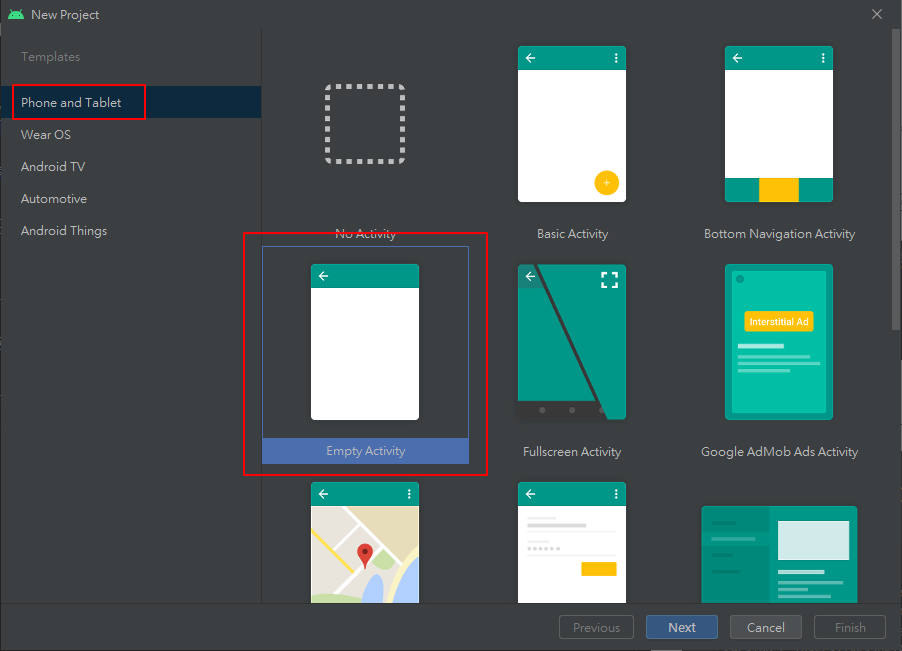
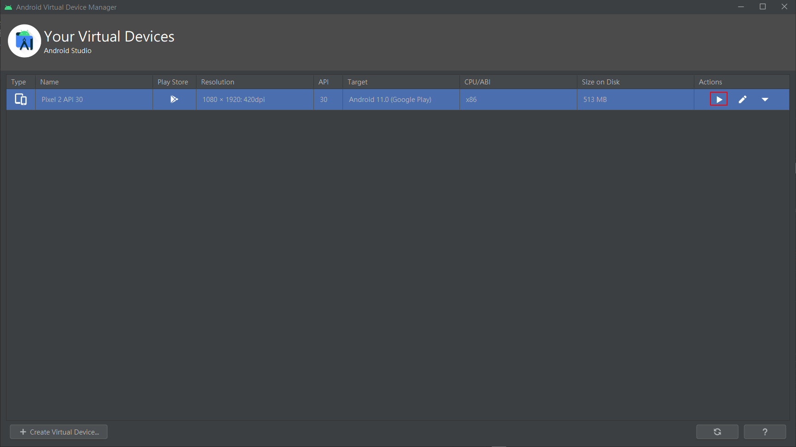
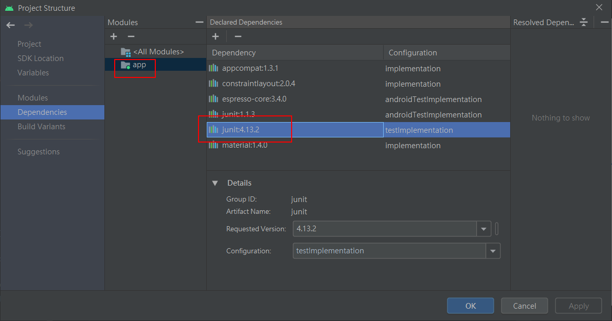

# Android

Android筆記


# 下載及安裝Android Studio

官網

https://developer.android.com/studio


安裝完成


# 創建第一個項目





創建完成的資料夾結構


調整功能列的字體大小


調整代碼的字體大小


預覽layout畫面

右上角可切換視圖或配置代碼


# Drawable和mipmap的區別

- 9-Patch圖片和Shape資源文件只能放在drawable目錄中
- 需要適應屏幕分辨率的圖片推薦放在mipmap目錄中，可以提高顯示性能、占用內存更少

# 新建模擬器


紅框處啟動模擬器




# 運行專案

過程有碰到一些問題

說是sdk版本的問題


原sdk版本


降低sdk版本


看到app冒紅底線，順便找尋問題

發現是依賴版本出了問題，指定了junit的版號，就沒冒紅底線了



可以進一步運行了，又碰到新的問題


要修改AndroidManifest.xml

```xml
<activity android:name=".MainActivity" android:exported="false">
```


這樣之後可以正常build了


但發現一開始建的模擬器會顯示"應用程式未安裝"


猜測可能是模擬器的版本過新，需要有更進階的設定

這邊練習使用，於是先再安裝舊一點的模擬器版本方便測試

# 新建另一個模擬器


再重新運行專案，可以成功運行了


# 練習 - 新建 桌面檯球 模塊


新的專案運行一樣會報錯

- sdk版本
- android:exported="false"

照上面提到的方式解決即可

## 拷貝bg.png


## src/main/res/layout/activity_main.xml

```xml
<?xml version="1.0" encoding="utf-8"?>
<FrameLayout xmlns:android="http://schemas.android.com/apk/res/android"
    xmlns:tools="http://schemas.android.com/tools"
    android:layout_width="match_parent"
    android:layout_height="match_parent"
    android:paddingBottom="16dp"
    android:paddingLeft="16dp"
    android:paddingRight="16dp"
    android:paddingTop="16dp"
    android:background="@mipmap/bg"
    tools:context=".MainActivity">

    <TextView
        android:layout_width="wrap_content"
        android:layout_height="wrap_content"
        android:layout_gravity="center"
        android:textSize="18sp"
        android:textColor="#115572"
        android:text="@string/start" />

</FrameLayout>
```

## src/main/res/values/strings.xml

```xml
<resources>
    <string name="app_name">桌面檯球</string>
    <string name="start">開始遊戲</string>
</resources>
```

## 執行畫面


# 練習 - 新建 桌面檯球 模塊 - 使用java創建FrameLayout


## 拷貝bg.png

## com.ives.MainActivity

```java
public class MainActivity extends AppCompatActivity {

    @Override
    protected void onCreate(Bundle savedInstanceState) {
        super.onCreate(savedInstanceState);
        //setContentView(R.layout.activity_main);
        FrameLayout frameLayout = new FrameLayout(this);
        frameLayout.setBackgroundResource(R.mipmap.bg);
        setContentView(frameLayout);

        TextView text1=new TextView(this);
        text1.setText("開始遊戲");
        text1.setTextSize(TypedValue.COMPLEX_UNIT_SP,18);
        text1.setTextColor(Color.rgb(17,85,114));

        FrameLayout.LayoutParams params = new FrameLayout.LayoutParams(ViewGroup.LayoutParams.WRAP_CONTENT,
                ViewGroup.LayoutParams.WRAP_CONTENT);
        params.gravity = Gravity.CENTER;
        text1.setLayoutParams(params);

        text1.setOnClickListener(new View.OnClickListener(){

            @Override
            public void onClick(View view) {
                new AlertDialog.Builder(MainActivity.this).setTitle("系統提示")
                        .setMessage("遊戲有風險，進入需謹慎，真的要進入嗎？")
                        .setPositiveButton("確定",
                                new DialogInterface.OnClickListener() {
                                    @Override
                                    public void onClick(DialogInterface dialogInterface, int i) {
                                        Log.i("桌面台球","進入遊戲");
                                    }
                                }).setNegativeButton("退出", new DialogInterface.OnClickListener() {
                    @Override
                    public void onClick(DialogInterface dialogInterface, int i) {
                        Log.i("桌面台球","退出遊戲");
                        finish();
                    }
                }).show();
            }
        });
        frameLayout.addView(text1);
    }
}
```

## 執行畫面


log輸出

